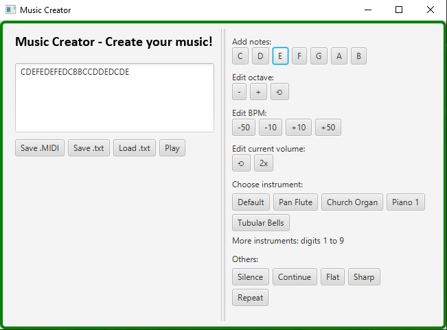
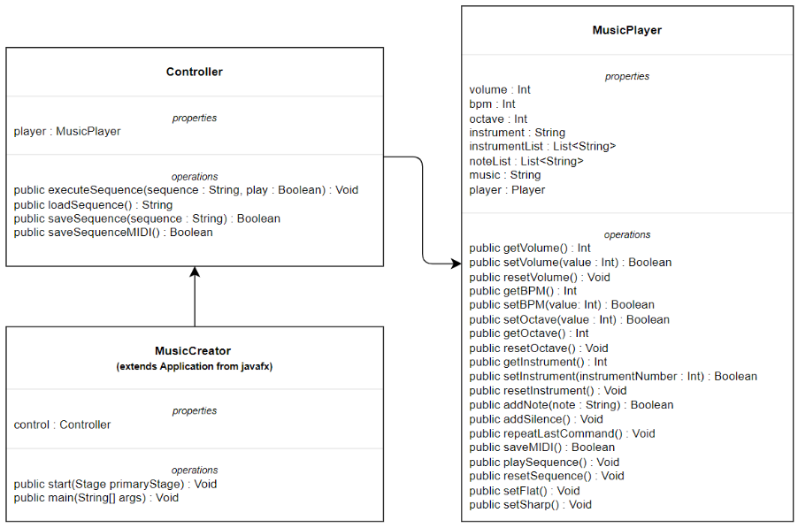

# music-creator

Simple music creator using Java and Jfugue music lib.

Given a list of commands, those are converted to music when the user presses play.

Project developed for the discipline of Program Construction Techniques (INF01120) at UFRGS.

## Dependencies

- Jfugue
- Javafx
